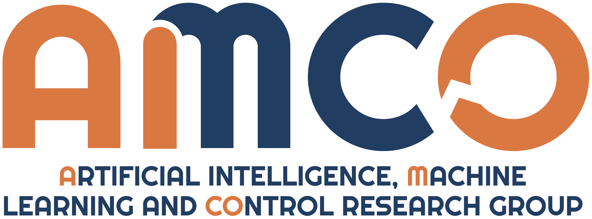

# A Fairness-Oriented Reinforcement Learning Approach for the Operation and Control of Shared Micromobility Services
## Matteo Cederle, Luca Vittorio Piron, Marina Ceccon, Federico Chiariotti, Alessandro Fabris, Marco Fabris, and Gian Antonio Susto
#### Department of Information Engineering, University of Padova, 35131 Padua via Gradenigo 6/B, Italy
#### Paper accepted to ACC 2025



### Abstract
As Machine Learning grows in popularity across various fields, equity has become a key focus for the AI community. However fairness-oriented approaches are still underexplored in smart mobility. Addressing this gap, our study investigates the balance between performance optimization and algorithmic fairness in shared micromobility services providing a novel framework based on Reinforcement Learning.
Exploiting Q-Learning, the proposed methodology achieves equitable outcomes in terms of the Gini index across different areas characterized by their distance from central hubs. Through vehicle rebalancing, the provided scheme maximizes operator performance while ensuring fairness principles for users, reducing iniquity by up to 80% while only increasing costs by 30% (w.r.t. applying no equity adjustment). 
A case study with synthetic data validates our insights and highlights the importance of fairness in urban micromobility.

## How to train and/or evaluate the algorithm
1. Clone the repository

2. Train all the scenarios across different seeds: 
   ```
   ./training.sh
   ```
3. After training, evaluate the algorithm. You can also just evaluate the algorithm by using our pre-trained models.
   ```
   # The different scripts correspond to the different scenarios: from 2 to 5 categories
   python evaluation_2.py
   python evaluation_3.py
   python evaluation_4.py
   python evaluation_5.py
   ```
4. Plot the results:
   ```
   # Here, x must be substituted with the number of categories
   python boxplots.py --cat 5 --save
   python paretoplots_new.py --cat x --save
   ```

## Cite this work
If you find our work interesting for your research, please cite the [paper](https://arxiv.org/pdf/2403.15780v2). In BibTeX format:

```bibtex
@misc{cederle2024fairnessorientedreinforcementlearningapproach,
      title={A Fairness-Oriented Reinforcement Learning Approach for the Operation and Control of Shared Micromobility Services}, 
      author={Matteo Cederle and Luca Vittorio Piron and Marina Ceccon and Federico Chiariotti and Alessandro Fabris and Marco Fabris and Gian Antonio Susto},
      year={2024},
      eprint={2403.15780},
      archivePrefix={arXiv},
      primaryClass={eess.SY},
      url={https://arxiv.org/abs/2403.15780}, 
}
```
